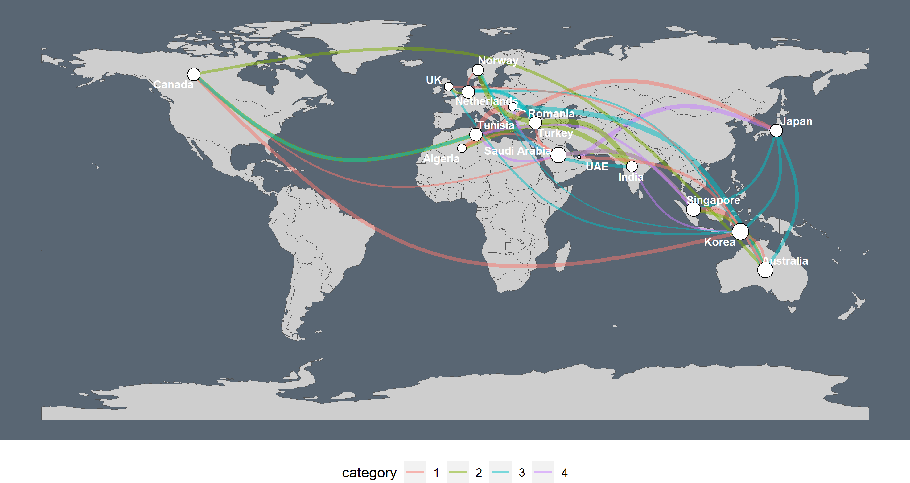

```{r setup, include=FALSE}
knitr::opts_chunk$set(echo = TRUE)
```

Showcasing the possibilities of using `ggraph` with a layout that understands geographical space positions via `sf`. These examples use `sfnetworks` and my implementation of `ggraph` still under construction before a PR is possible, and can be installed as:

```{r, eval = F}
remotes::install_github("loreabad6/ggraph")
```

## Showcase

### Break Free from Plastic
The data used here comes from the [Tidy Tuesday](https://github.com/rfordatascience/tidytuesday) weekly data project. This is week 5 of 2021 were we analyzed data from the "Break Free from Plastic" initiative. Have a look at the final plot:


Here is a [step by step guide](https://github.com/loreabad6/TidyTuesday/blob/master/R/2021/week_05.md) on how to recreate it.

### Airports in the U.S.

This example is inspired on this [wonderful blogpost on Network Visualization](https://kateto.net/sunbelt2019#overlaying-networks-on-geographic-maps) by Katherine Ognyanova, where I tried to recreate the last plot. 


Code [here](code/airports.R).

### The fourth way of visualizing a graph on a map

In his [very helpful blogpost](https://datascience.blog.wzb.eu/2018/05/31/three-ways-of-visualizing-a-graph-on-a-map/) Markus Neteler (@internaut) guides us through three different ways to plot a spatial graph on a map. With the `ggraph` and `sfnetworks` combination, we can add a fourth way!



Code [here](code/graph-on-a-map.R).

### {sfnetworks} showcase

Examples of what can be done with the `sfnetworks` package is shown here, with all the figures created with `ggraph` and `ggplot2`! 


To create this GIF I used `xaringan` and you can find the raw [`.Rmd` file here](code/sfnetworks-showcase/index.Rmd)
