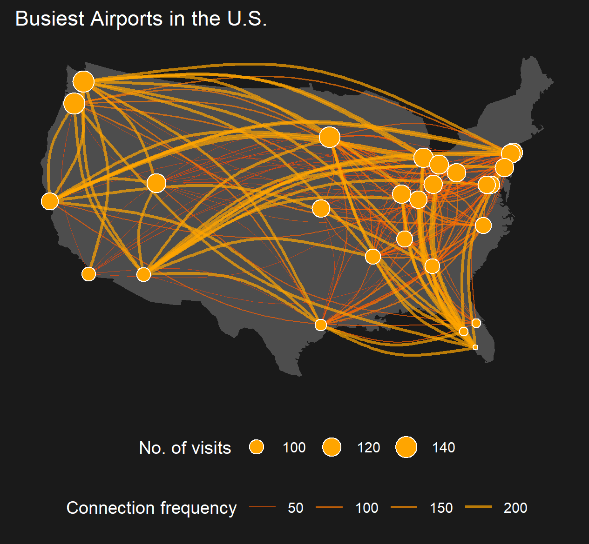

Showcasing the possibilities of using `ggraph` with a layout that understands geographical space positions via `sf`. These examples use `sfnetworks` and my implementation of `ggraph` still under construction before a PR is possible, and can be installed as:


```r
remotes::install_github("loreabad6/ggraph")
```

I opened [an issue](https://github.com/thomasp85/ggraph/issues/275) to illustrate the progress of my PR and to ask for some help going forward! Any contribution is really appreciated!

As I keep working on my `ggraph` PR, I will illustrate the initial steps to integrate `sfnetworks` and `ggraph` for spatial network visualizations. 

## Using a custom layout in `ggraph`

`ggraph` works with three main concepts: layouts, nodes and edges. In [this entry](https://loreabad6.github.io/ggraph-spatial-examples/custom_layouts) I illustrate how to use a custom `ggraph` layout based on geographic coordinate reference systems to combine `sfnetwork` objects with spatially implicit edges with other `ggplot2` functions. 

The data used here comes from the [Tidy Tuesday](https://github.com/rfordatascience/tidytuesday) weekly data project. This is week 5 of 2021 where we analyzed data from the "Break Free from Plastic" initiative. Have a look at the final plot:


If you are further interested, remember to check the [full entry here](https://loreabad6.github.io/ggraph-spatial-examples/custom_layouts).

## More examples!

Here are some plot examples using `remotes::install_github("loreabad6/ggraph")`. 

### Airports in the U.S.

This example is inspired on this [wonderful blogpost on Network Visualization](https://kateto.net/sunbelt2019#overlaying-networks-on-geographic-maps), where I tried to recreate the last plot. 



Code [here](code/airports.R).
